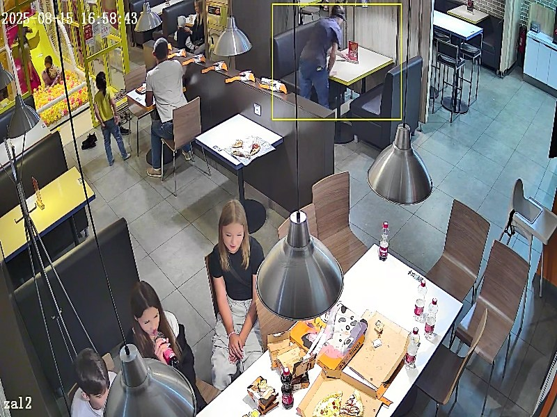
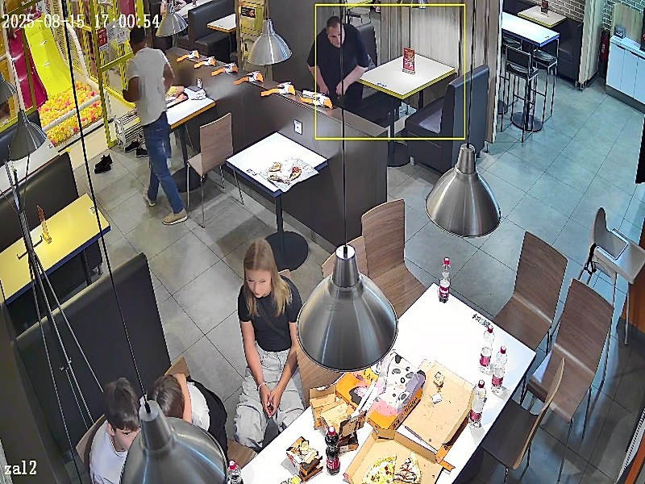
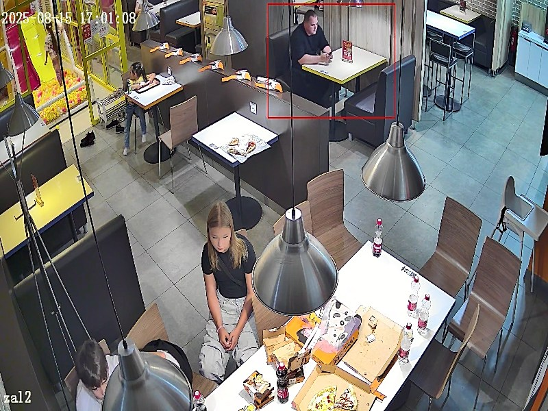

# Test: Table Occupancy Detection from Video

Решение тестового задания по детекции занятости столиков  
Определяет, когда столик свободен или занят, и считает среднее время между уходом гостя и приходом следующего

Задание: [**Test_Task_Table_Occupancy_2026.pdf**](https://drive.google.com/file/d/1zYHC-YDNYSBvF8pM37s36PsOPF_erYa9/view?usp=sharing) (Google Drive)

> [!NOTE]
> Оригинальное задание называется "Прототип системы детекции уборки столиков по видео" - в данном решении уборка столов никак не была учтена

Код прототипа в Google Colab <a href="https://colab.research.google.com/drive/14AVD8ERPJSH4Bcu5zsFUgMKhyiJ-8gkX"></a>


## Стек технологий

- [python](https://www.python.org/) >= 3.10
- [ultralytics](https://github.com/ultralytics/ultralytics) - для детекции людей в кадре
- [pandas](https://github.com/pandas-dev/pandas) сохранения результатов детекции в датафрейм


## Логика работы скрипта

- Используется YOLO (модель `yolo11n`) для обнаружения людей в выделенной области
- Столик считается занятым, если человек находится в зоне не менее 10 секунд подряд (параметр `ENTER_TIME_THRESHOLD=10`)
- Столик считается свободным, если человека нет в зоне не менее 10 секунд подряд (параметр `EXIT_TIME_THRESHOLD=10`)
- Детекция выполняется на каждом втором кадре для ускорения (параметр `DETECT_EVERY_N_FRAMES=2`)
- Для ускорения инференса используется батчевая обработка (параметр `BATCH_SIZE=128`)
- Итоговое видео сохраняется в разрешении 800x600 (параметры `NEW_WIDTH` и `NEW_HEIGHT`) - чтобы не занимало много места на диске


## Установка библиотек

Установка библиотек
```sh
pip install -r requirements.txt
```


## Запуск детекции

**Запуск детекции**
```sh
python main.py --video "путь_к_видео.mp4"
```
Например
```sh
python main.py --video "видео 1.mp4"
```

При первом запуске появится окно для выбора области столика  
Выделите зону и нажмите пробел или Enter

Видео на котором производилась детекция:
https://drive.google.com/drive/folders/12S_aIDePY_q-LW4U3hovVaoyCROe2NMg?usp=sharing


## Результаты

**Результаты работы**

После обработки создаются файлы:
- `название_видео_result.mp4` - видео с отмеченным столиком
- `название_видео_results.csv` - таблица с результатами детекции по каждому кадру
- `название_видео_analysis.png` - графики состояния занятости стола и распределения времени ожидания
- `название_видео_results.txt` - текстовый отчет

Опциональная конвертация видео для уменьшения размера через ffmpeg
```sh
ffmpeg -i "видео 1_result.mp4" -vcodec libx264 -crf 23 -preset fast output.mp4
```

Пример папки с результатами:
https://drive.google.com/drive/folders/1rM64ZInW_pruIcwy-XDW55IAHG2D9QCT?usp=sharing


**Тестовое видео**

Для тестирования использовалось видео `видео 1.mp4` (длительность 903 сек, 20 FPS, 2560x1440)  
Выбран столик в верхней части кадра, справа от центра


**Отчет**
```
# ОТЧЕТ ПО АНАЛИТИКЕ
Дата: 2026-03-28 21:34:47.589004
Видео: видео 1
Общая продолжительность: 903.30 сек
Разрешение: 2560x1440
Всего кадров: 18066
FPS: 20

## Статистика занятости
Время свободного места: 659.03 сек
Коэффициент свободного места: 72.96%
Количество событий ухода: 0
Количество событий прихода: 1

## Статистика времени ожидания
Недостаточно данных для расчета (нет пар уход->приход)
```

Статистика времени ожидания не была расчитана так как не удалось найти стол когда человек приходит и уходит (в текущем варианте изначально стол путой, потом приходит человек и сидит до конца видео)


**Примеры кадров с рузультатами детекции**

---
Бокс зеленого цвета так как в кадре нет человека

<details>
<summary>Стол не занят</summary>


</details>


---
Бокс желтого цвета - в кадре появляется сотрудник заведения (потом он уходит и бокс снова становится зеленым)

<details>
<summary>Возможно занят</summary>


</details>


---
Бокс желтого цвета - посетитель садится за стол

<details>
<summary>Возможно занят</summary>


</details>


---
Бокс красного цвета - человек сидит за столом более `ENTER_TIME_THRESHOLD` секунд

<details>
<summary>Стол занят</summary>


</details>
